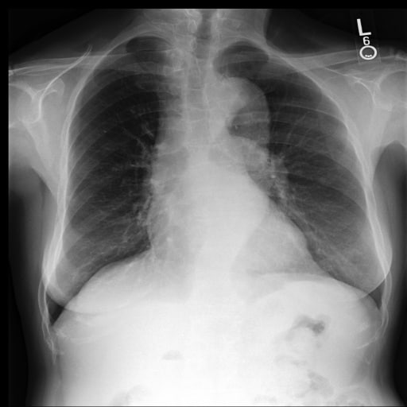
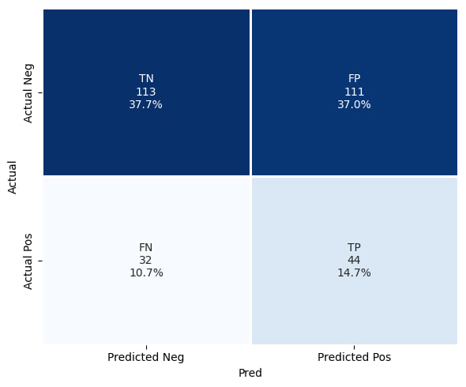
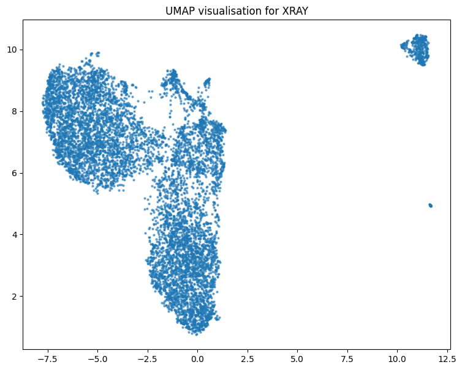

<h1 align="center">Chest X-ray RAG with Gemma 3</h1>

<p align="center">
  Retrieval-Augmented Generation system for chest X-ray images
)
</p>

<p align="center">
  
</p>

### Run
**unzip `chroma_db/db.zip`**
```bash
docker-compose up --build
```
**FastAPI: http://localhost:8000/docs**


# Core Stack
- **LLM**  
  Gemma 3 4B (Optional)
- **Embedding Model**  
  google/medsiglip-448 (without fine-tuning)
- **Vector Database**  
  Chroma
- **Web Framework**  
  FastAPI

| Metric        | Value    |
|:--------------|:---------|
| **Precision** | **0.28** |
| **Recall**    | **0.58** |
| **F1-Score**  | **0.38** |





# Overview

1. **User uploads chest X-ray**  
   → processed in `src/app/main.py`

2. **Image → Embedding**  
   - Model: **MedSigLIP-448**  
   - Code: `src/embedding/model.py` + `img2emb.py`  
   → dense vector

3. **Similarity Search**  
   - Query **Chroma** vector store  
   - Code: `src/vectorstore/chroma.py` + `retriever.py`  
   → top-k similar images + metadata

4. **LLM Inference**  
   - Input: new image + context prompt  
   - Model: **Gemma 3 4B**  
   - Code: `src/llm/ask.py`  
   → diagnosis, explanation, confidence, differential diagnosis

Dataset: https://www.kaggle.com/datasets/simhadrisadaram/mimic-cxr-dataset
